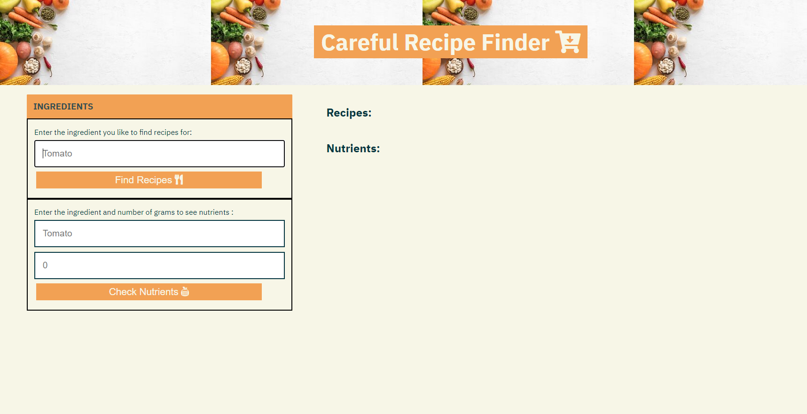

# Calorie Hunter
This app uses food data API's to provide the user with more awareness of their food consumption.

User Story: As a user, I want to be more conscious of my diet.

As a user, I want to find the ingredients in a meal or make a meal out of ingredients.
As a user, I also want to find the macronutrients in that meal.
As a user, I want to combine these tasks so that when I input ingredients of a meal, I will be seamlessly fed macronutrients.

## Technologies used:
Implemented the use of API’s to retrieve data such as macro nutrients for different ingredients and the recipes.
Used query selectors to target elements in the page and retrieve them as variables to used in the code.
Implemented event listeners to achieve functionality.

## Usage
The user is presented with two forms one for the recipes and one for the macros, the user can fill both or either of the forms to retrieve nutrients with calories or a random recipe that will bring a YouTube video that walks you to how to complete this dish. 

### Wireframe:https://app.diagrams.net/

### API's: Spoonacular
https://spoonacular.com/food-api

### USDA Food Data API
https://fdc.nal.usda.gov/api-guide.html

## https://endres2.github.io/CalorieHunter/
